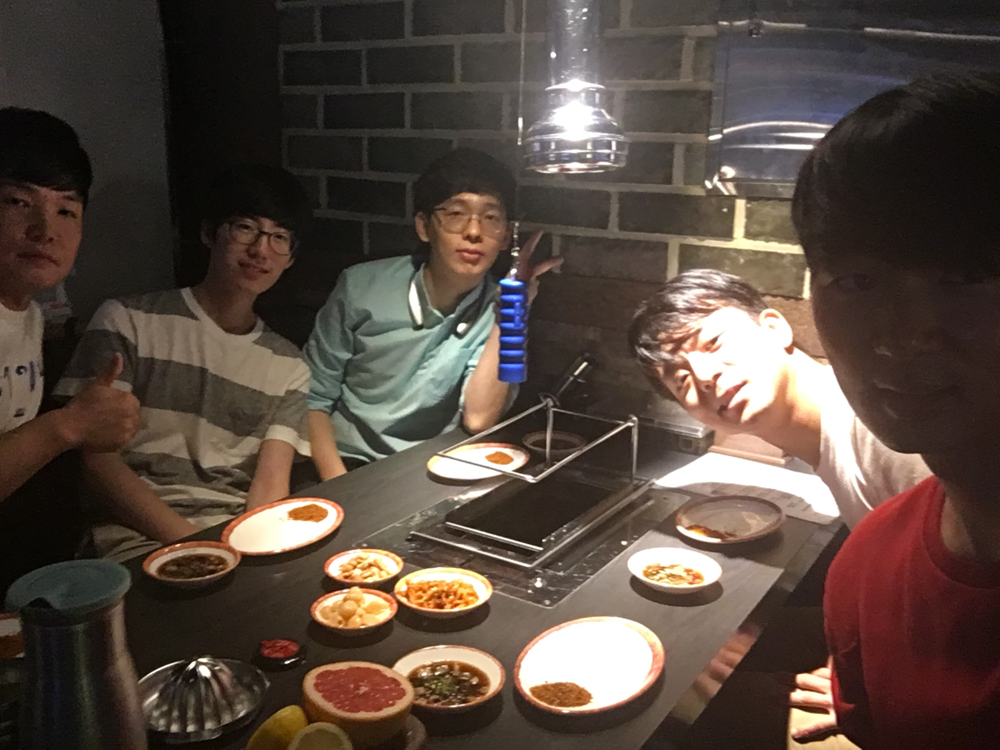
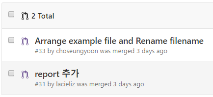

# 일일 보고 : 넷째날(27일)

## 일일 공동 목표

* npm-webpacks-boilerplate : 폴더 및 코드 정리, 코드 리뷰

### 오프라인 모임 참여

## 활동 내역

### 요약
| 오늘의 PR | 수락된 PR | 오늘 생성된 이슈 | 닫힌 이슈 |
| :---: | :---: | :---: | :---: |
| [2건](https://github.com/JeffGuKang/npm-webpack-boilerplate/pulls?utf8=%E2%9C%93&q=is%3Apr%20created%3A2016-09-27) | [2건](https://github.com/JeffGuKang/npm-webpack-boilerplate/pulls?utf8=%E2%9C%93&q=is%3Apr%20created%3A2016-09-27%20is%3Amerged) | [2건](https://github.com/JeffGuKang/npm-webpack-boilerplate/issues?utf8=%E2%9C%93&q=is%3Aissue%20created%3A2016-09-27) | [2건](https://github.com/JeffGuKang/npm-webpack-boilerplate/issues?utf8=%E2%9C%93&q=is%3Aissue%20created%3A2016-09-27%20is%3Aclosed) |

3명의 멤버가 2건의 Pull-Request와 2건의 이슈를 열었습니다.

### Pull-Request

오늘 생성되고 수락된 PR은 아래와 같습니다.

### 그룹별 세부 활동 사항

### Docs
- **Group Goal**
	- `README.md` 내용 보충 및 업데이트
	- 오타 고치기

- 김무훈([@MuhunKim](https://github.com/MuhunKim)) : Group Leader
	- `daily/01_instagram` 오타 고침 & 첫 영문자를 대문자로 수정(Capital letter)
	- `daily/01_instagram` 전체적으로 2차 수정
		- 각 조의 참가자 별 역할을 추가함
		- Docs Group의 Report 내용 보충 및 추가

- 최규호 ([@gyuho26](https://github.com/gyuho26))
	- Github 사용법 숙지
	- Git 명령어 공부
	- daily report 갱신을 위해 original repository에 pull request.

### Example(A-Yo)

- Group Goal

- 개인활동 사항
	- 이성현
		- karma로 테스트 실행(`npm run test`)
		- FireFox, 크롬 미설치시 버그 발견, 이슈 작성
		- 오프라인 모임!!(사진 개인적으로 전송 부탁드립니다.^^)

	- 조승윤
		- Example code 작성
		- Rearranged folder & Integrate files
		- 오프라인 모임 참여

### Test
- Group Goal

- 오도근
        - 테스트 코드 주석 추가
	- 팀원들 질의응답

- 이현주
        - .gitignore 파일에 report 추가

### Task

- Team Goal
	- Webpack 이해하고 사용하기
	- Git 숙달
	- ES6 문법에 맞춘 코드 스타일 통일

- 신미르
	- Git 정리
	- mocha + chai + sinon 을 통한 일반적인 JS unit test 구성에 대한 공부

- 이태순
	- git & npm  전체적인 흐름 복습
	- 멘토님이랑 깃 이랑 npm 에 대해 정리
	- example code 가 calculator 를 사용하도록 수정해봄
	- 오프라인 모임 참여

- 박경원
	- github를 통한 Pull-Request 연습(DailyReport)
	- 수정된 코드 모니터링 및 비교
	- 오프라인 모임 참여
