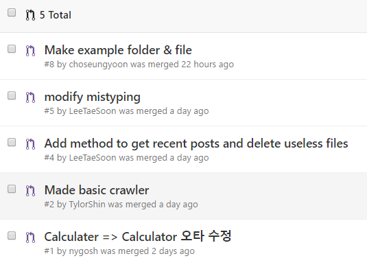

# 일일 보고 : 여섯째날(29일)

## 특이사항

> web-side 에서 node-side(`bable-node`)로 이동하게된 이유를 적어주시면 됩니다.

> 해결법도 적어주세요..

## 활동 내역

### 요약 : [instaparser.js](https://github.com/Instaparser/instaparser.js)
| 오늘의 PR | 수락된 PR | 오늘 생성된 이슈 | 닫힌 이슈 |
| :---: | :---: | :---: | :---: |
| [6건](https://github.com/Instaparser/instaparser.js/pulls?utf8=%E2%9C%93&q=is%3Apr%20created%3A2016-09-29) | [5건](https://github.com/Instaparser/instaparser.js/pulls?utf8=%E2%9C%93&q=is%3Apr%20created%3A2016-09-29%20is%3Amerged) | [2건](https://github.com/Instaparser/instaparser.js/issues?utf8=%E2%9C%93&q=is%3Aissue%20created%3A2016-09-29) | [2건](https://github.com/Instaparser/instaparser.js/issues?utf8=%E2%9C%93&q=is%3Aissue%20created%3A2016-09-29%20is%3Aclosed) |

5명의 멤버가 6건의 Pull-Request와 2건의 이슈를 열었습니다.

### Pull-Request

오늘 생성되고 수락된 이슈는 아래와 같습니다.

### 그룹별 세부 활동 사항

### Docs

- 김무훈
  - [Kosslab-kr/KOSShack2016](https://github.com/Kosslab-kr/KOSShack2016) 재작성

- 최규호
 - 오프라인 모임 참여
 - README.md 수정
 - Git 명령어 공부

### Test

- 오도근
        - Insta Parser 테스크 코드 작성
	- 오프라인 모임 참여
	- git 전체 프로세스 팀원들에게 공유

- 이현주
        - 오프라인 모임 참여
	- git 복습, node.js 설치
	- test 코드 분석, 질문

### Example

- 조승윤(@choseungyoon)
	- [Pull-Request #8](https://github.com/Instaparser/instaparser.js/pull/8) : Instaparser example code 작성
	- 오프라인 모임 참여

- 이성현
 	- request 관련 버그 이슈 제기
 	- axios, request 스터디
 	- json 파싱 스터디

### Task

- Team Goal
	- Webpack 이해하고 사용하기
	- Git 숙달
	- ES6 문법에 맞춘 코드 스타일 통일

- 신미르
	- 인스타 데이터 수집을 위한 기본 환경 과 클래스 구축
	- 조원들 Q&A 실시

- 이태순
	- npm-webpack-boilerplate 코드 정리
		- [divide code](https://github.com/TylorShin/npm-module-es2015-boilerplate/pull/13)
	- 오프라인 모임 참여
	- Instaparser Add method
		- [최신 글 가져오기](https://github.com/Instaparser/instaparser.js/pull/4)

- 박경원
	- github 정리 및 DailyReport 수정
	- 오프라인 모임 참여
