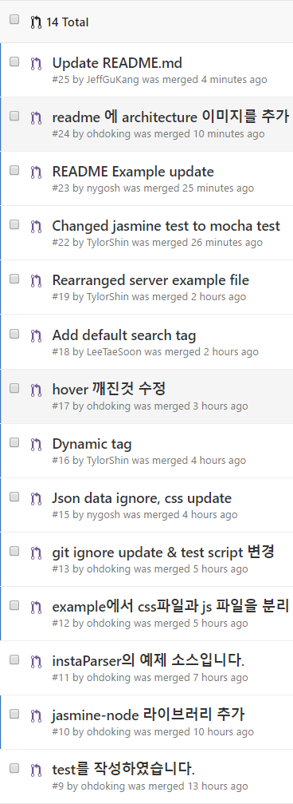

# 일일 보고 : 일곱번째날(30일)

## 일일 공동 목표

* instaparser 모듈 개발 마무리
* 일일 보고서 작성 마무리

## 활동 내역

### 요약
| 오늘의 PR | 수락된 PR | 오늘 생성된 이슈 | 닫힌 이슈 |
| :---: | :---: | :---: | :---: |
| [16건](https://github.com/Instaparser/instaparser.js/pulls?utf8=%E2%9C%93&q=is%3Apr%20created%3A2016-09-30) | [14건](https://github.com/Instaparser/instaparser.js/pulls?utf8=%E2%9C%93&q=is%3Apr%20created%3A2016-09-30%20is%3Amerged) | [1건](https://github.com/Instaparser/instaparser.js/issues?utf8=%E2%9C%93&q=is%3Aissue%20created%3A2016-09-30) | [0건](https://github.com/Instaparser/instaparser.js/issues?utf8=%E2%9C%93&q=is%3Aissue%20created%3A2016-09-30%20is%3Aclosed) |

### Pull-Request

오늘 생성되고 수락된 이슈는 아래와 같습니다.

### 그룹별 세부 활동 사항

### Docs
- 김무훈
  - [Kosslab-kr/KOSShack2016](https://github.com/Kosslab-kr/KOSShack2016) 재작성
### Docs
	

### Test

### Example
- 이성현
 	- Example 작성
 	- Example css 작성&수정
 	- Example cmd 작성
 	- Example Readme 작성
- 조승윤
	- 최종 발표자료 작성
	- 발표준비
	- 코드 오타 수정
### Task
