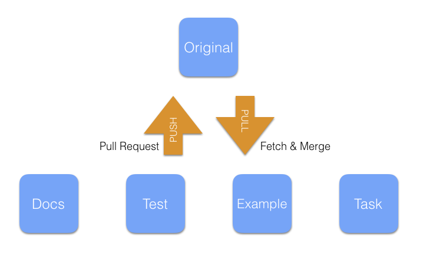

# OneTeam

## Goal

- 각자 기여할 수 있는 부분에 꾸준히 기여를 해보자.
- 서로 부족한 부분, 혹은 발전될 부분을 도와주자.
- **모두 빠짐없이** 프로젝트에 자신의 흔적을 남기자.
- 첫번째 릴리즈 버전 배포

## 사전지식

- Git / Github / Markdown
- Node.js / npm
- JavaScript : [Airbnb/JavaScript](https://github.com/tipjs/javascript-style-guide)

## Repository

[JeffGuKang/npm-es2015-boilerplate](https://github.com/JeffGuKang/npm-es2015-boilerplate)

# Team

주로 맡을 역할을 조(Group)단위로 나눴습니다. Git초보분과 숙련자분들을 조마다 함께 배정하였습니다.


### Example(A-Yo) : 예제 코드 작성

- 조승윤 ([@choseungyoon](https://github.com/choseungyoon)) : Group Leader
- 성대경 ([@sdk115](https://github.com/sdk115))
- 이성현 ([@nygosh](https://github.com/nygosh))

### Test : 테스트 코드 작성

- 오도근 ([ohdoking](https://github.com/ohdoking)) : Group Leader
- 이현주 ([lacieliz](https://github.com/lacieliz))
- 이동기 (unknow)

### Docs : 문서 작성 및 Daily Report 관리

- 김무훈([@MuhunKim](https://github.com/MuhunKim)) : Group Leader
- 이기신 ([@kshinlee](https://github.com/kshinlee)) : Team Leader
- 최규호 ([@gyuho26](https://github.com/gyuho26))
- 김강민 ([@kangmin93](https://github.com/kangmin93))

### Task : 개발

- 신미르 ([@TylorShin](https://github.com/TylorShin)) : Group Leader
- 이태순 ([LeeTaeSoon](https://github.com/LeeTaeSoon))
- 박경원 ([cosmicboon](https://github.com/cosmicboon))

## 일정 목표

1. 27일까지 [npm-es2015-boilerplate](https://github.com/JeffGuKang/npm-es2015-boilerplate) 릴리즈 첫 버전 배포
2. [npm-es2015-boilerplate](https://github.com/JeffGuKang/npm-es2015-boilerplate) 릴리즈 버전을 기반으로 새로운 모듈 생성 및 npm 업로드

## Project

> 개발 방향을 작성합니다.

> ex) 인스타그램 크롤링은 어떻게 할것인가?

## 온라인 커뮤니케이션

- Slack : [kosshackathon1.slack.com](https://kosshackathon1.slack.com)
- Github : 이슈 코멘트 / Pull-Request 코드 리뷰

## 2016년 9월 24일

- 해카톤 개회식 당일
- 자기소개 및 의견 발표 겸 토론
- 조 모집 브리핑 : 자유의사에 의한 팀 분할
- 팀별 목표 설정 / 역할 분배
- 모든 팀원 Slack에 등록 / Slack에 팀 별 Channel 등록
- 조별마다 팀의 Github Repository를 포크해서 관리 / 조별 Collaborator 등록

#### Task

- 신미르 : [@TylorShin](https://github.com/TylorShin) : Group Leader
 - [Pull-Request #8](https://github.com/JeffGuKang/npm-module-es2015-boilerplate/pull/8)
	- Webpack을 통해 Build 및 Dev server를 실행할 수 있도록 해당 packages와 scripts를 추가하였습니다.
	- `package.json` 을 업데이트하였습니다.
	- ESLINT 설정을 잡았습니다.

#### TEST

- 오도근
	- 조원에게 git의 사용법을 알려주고 역할을 분배했습니다.
	- 역할
		- 오도근: 테스트툴 조사 후 해당 툴로 테스트 코드 작성
		- 이동기: 작성된 테스트 코드 리뷰
		- 이현주: git과 javascript 학습 및 복습

#### Docs

* 김무훈([@MuhunKim](https://github.com/MuhunKim)) : Group Leader
 * [Pull-Request #6](https://github.com/JeffGuKang/npm-module-es2015-boilerplate/pull/6)  : `package.json`에서 `author` 키워드 대신 `contributors`로 변경 후 `author` 목록 추가
 ```js
 "contributors": {
	 "author": "Jeff Gu Kang",
	 "author": "Muhun Kim <muhun.kim@gmail.com> (http://blog.muhun.kim)"
 },
 ```
 * [Pull-Request #8](https://github.com/JeffGuKang/npm-module-es2015-boilerplate/pull/8#pullrequestreview-1436878) 코드리뷰 : Git을 시험삼아 쓰기 위해 Git 초보분들이 수정한 코드를 자신이 직접 원래대로 되돌리는것도 좋을거라는 의견을 남겼습니다.
   * 해당 의견을 바탕으로 [Issue #11](https://github.com/JeffGuKang/npm-module-es2015-boilerplate/issues/11) 생성
	 * [@JeffGuKang](https://github.com/JeffGuKang)님이 해당 의견을 바탕으로 [이슈를 만들어보라고](https://github.com/JeffGuKang/npm-module-es2015-boilerplate/pull/8#discussion_r80363459) 해서 만듬
	 * 문제 해결이 완료된걸 [코드리뷰로 확인함](https://github.com/JeffGuKang/npm-module-es2015-boilerplate/pull/12#pullrequestreview-1453734)
 * 팀원들에게 Collaborator 권한 부여
 

## 2016년 9월 25일

#### Docs

- 최규호 ([@gyuho26](https://github.com/gyuho26))
	- Atom Editor 설치
	- Slack에 올라온 linter와 linter-eslint 설치
	- Slack에 올라온 git 관련 블로그 일부 읽음
	- github에서 갱신되는 것 확인을 위해 MuhunKim/npm-gulp-es2015-boilerplate를 watch 눌러놓음
	- 'OneTeam'의 사전지식에 적혀있는 JavaScript Style guide에 대한 부분 일부 읽음
	- Markdown 문법에 관한 간략한 조사
	- 조장님의 저장소에서 같이 작업하기 위해 협업 권한을 받음(이메일로 확인)

- 김강민 ([@kangmin93](https://github.com/kangmin93))
	- 하루패드 설치
	- markdown 문법 익히기
	- github 사용법 및 git 설치 숙지
	- 조장님의 저장소에서 같이 작업하기 위해 협업 권한을 받음

#### Test

- Team Goal
	- 해당 boilerpate에 테스트를 할 수 있는 환경 설정을 하고 예제 테스트 코드를 작성한다.

- 오도근
	- 테스트 툴 선정 (Karma & jasmine)
	- 선정 기준: 신뢰도 및 이용 점유율(출처: https://ashleynolan.co.uk/blog/frontend-tooling-survey-2015-results)
	- 테스트 툴 학습
	- 테스트 툴 boilerpate 참조(출처: https://github.com/zyml/es6-karma-jasmine-webpack-boilerplate)

#### Example(A-Yo)

- Team Goal
	- GitHub 사용법 숙달
	- 다른 Open-Source Example 살펴보기
	- Npm, Gulp 사용하여 Example 수정

- 개인활동 사항
	- 이성현
		- GitHub Full-Request 요청
		- Brach로 add, commit, push 등 소스 수정
		- 기본 `src`폴더 내의 코드들을 `console.log()` 대신 `return`으로 수정하여 Example 구성

	- 조승윤
        - 팀원들 github 질문 받아주기
        - 다른 Open-Source Example 분석

	- 성대경
		- Github 기본 개념 학습
		- 자바스크립트 기본 개념 학습

#### Task

- Team Goal
	- Webpack 이해하고 사용하기
	- Git 숙달
	- ES6 문법에 맞춘 코드 스타일 통일

- 신미르
	- build script 작성
	- 안쓰는 gulp logic 제거
	- 기본 module system example 작성
	- conflict 제거

- 이태순
	- Webpack document, 블로그 등을 통해 webpack 구조 이해
	- build 에 필요한 파일과 develop 에 필요한 파일 분류
	- Git shell 명령어 공부
	- ES6 문법 공부 & 문법에 맞게 코드 수정

- 박경원
	- Git 개념 & 명령어 공부
	- ES6 문법 공부

## 2016년 9월 26일

#### Docs

- 최규호 ([@gyuho26](https://github.com/gyuho26))
	- Github 사용법 숙지
	- CMD로 Pull requests 전송

#### Test

#### Example(A-Yo)

- Team Goal
	- Webpack 이해
	- 전체 process 이해
	- Git 활용
	- Example 코드 작성

- 개인활동 사항
	- 조승윤
		- Webpack 이해
		- node 및 npm 개념 파악
		- Sample example src 작성
	- 이성현
		- webpack plugin 적용하여 test index 확인
		- es6문법과 babel에 대한 이해
		- es6문법으로 간단하게 index 수정


#### Task

- Team Goal
	- Webpack 이해하고 사용하기
	- Git 숙달
	- ES6 문법에 맞춘 코드 스타일 통일

- 신미르
	- watch mode 도입
	- conflicts 해결
	- 팀원들 질문 받아주기

- 이태순
	- Webpack 공부
	- 프로젝트 폴더 정리
	- 사용하지 않던 이전 파일 삭제
	- scripts, src, views 폴더를 기본으로 파일 정리

- 박경원
	- github 실습
	- npm 개념
	- es6 의 차이점과 promise 개념
	- Webpack과 babel 의 관계 이해

<<<<<<< HEAD
  ## 2016년 9월 27일

  #### Task

  - Team Goal
  	- Webpack 이해하고 사용하기
  	- Git 숙달
  	- ES6 문법에 맞춘 코드 스타일 통일

  - 박경원
    - pr을 위한 프로세스 이해 및 실습
    - 히스토리 보며 코드 비교 학습
=======
### 9월 27일

#### Docs

- 최규호 ([@gyuho26](https://github.com/gyuho26))
	- Github 사용법 숙지
	- Git 명령어 공부
	- daily report 갱신을 위해 original repository에 pull request.

#### Example(A-Yo)

- Team Goal

- 개인활동 사항
	- 이성현
		- karma로 테스트 실행(npm run test)
		- FireFox, 크롬 미설치시 버그 발견, 이슈 작성
		- 오프라인 모임!!(사진 개인적으로 전송 부탁드립니다.^^)
>>>>>>> eda9977f4743e8ad307025b94800f9dcd0c7feb2

#### Task

- Team Goal
	- Webpack 이해하고 사용하기
	- Git 숙달
	- ES6 문법에 맞춘 코드 스타일 통일

- 신미르
  - Git 정리
  - mocha + chai + sinon 을 통한 일반적인 JS unit test 구성에 대한 공부

- 이태순
	- 멘토님이랑 깃 이랑 npm 에 대해 정리
	- git & npm  전체적인 흐름 복습

- 박경원
	- github를 통한 Pull-Request 연습(DailyReport)
	- 수정된 코드 모니터링 및 비교
