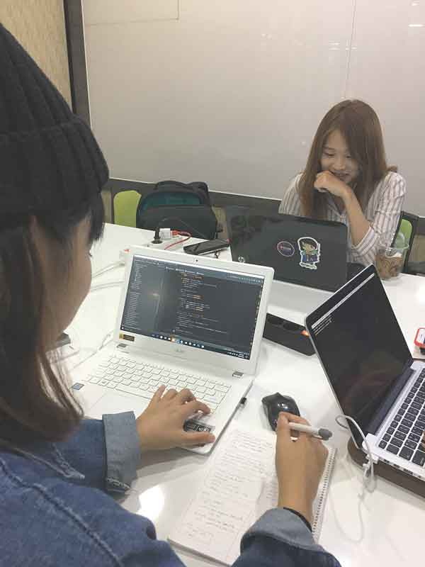

# 9월 23일

**참가자들에게 다음 의 내용 공지**

Gitter : https://gitter.im/ax5ui/KOSSLAB2016

## 3가지 레포지터리 사용
- https://github.com/ax5ui/ax5ui-kernel
- https://github.com/ax5ui/ax5docs
- https://github.com/kosslab-kr/ax5ui-quick-start

# 9월 24일

##팀원
금대건, 김동근, 김동영, 김동욱, 김인영, 김태근, 마진형, 박현준, 송다운, 위세라, 이소은, 이한빈, 한대승 (1명 불참)

## 해커톤 진행방법
코드개발, 테스트코드작성, 문서작성, 번역 으로 롤 분배
- 코드개발 : 김동근, 위세라, 이소은, 한대승
- 테스트코드작성 : 금대건, 박현준, 이한빈
- 문서작성 : 김동욱, 김인영, 김태근, 마진형, 송다운
- 번역 : 김동영

### 코드개발
https://github.com/ax5ui/ax5ui-kernel 를 포크하여 소스를 수정후 pull request하도록 안내 및 환경 설정
차주 월요일 모임을 통해 프로젝트 구조와 각각의 코드 개발범위 결정

### 테스트코드작성
ax5core에 대해 https://mochajs.org/ 기반의 테스트코드를 작성하여 ax5core의 메소드들에대해 테스트 자동화 되도록 작업
ax5ui-kernel https://github.com/ax5ui/ax5ui-kernel/tree/KOSS-Hackarthon-test 브랜치를 만들어 https://github.com/ax5ui/ax5ui-kernel/tree/KOSS-Hackarthon-test/src/ax5core/test 에 테스트코드를 커밋하기로 함.

### 문서작성
https://github.com/kosslab-kr/ax5ui-quick-start에 ax5ui 문서를 작성하여 커밋하고 http://guide.ax5.io/로 서비스가 될 수 있도록 하기로 함.

### 번역
프로젝트 전체 영문 문서 내용에 대해 감수하고 수정/보강하여 커밋하기로 함.

## pull request
- https://github.com/ax5ui/ax5ui-kernel/pull/16
- https://github.com/ax5ui/ax5ui-kernel/pull/17
- https://github.com/ax5ui/ax5ui-kernel/pull/18
- https://github.com/ax5ui/ax5ui-kernel/pull/19
- https://github.com/ax5ui/ax5ui-kernel/pull/21

총 5건의 pull request 

## commit
- https://github.com/kosslab-kr/ax5ui-quick-start/commit/2cf48ebcb551e4ed2cab7e296c8258d0fc0cf0ce
- https://github.com/kosslab-kr/ax5ui-quick-start/commit/85477198d977ee41d61c283e1d371928be01c9e2
- https://github.com/kosslab-kr/ax5ui-quick-start/commit/73725d6dd75d5896983229c611ca41e6b2ec6a31
- https://github.com/kosslab-kr/ax5ui-quick-start/commit/f2092d4f78bbe70ff5b0e756cb08edc66b7bfe15
- https://github.com/kosslab-kr/ax5ui-quick-start/commit/38dba95b5d8e42e033eb567cb4df125e5882d320
- https://github.com/kosslab-kr/ax5ui-quick-start/commit/f49ad63d8d0ee07ed4e1f5b1b7ccc11b596ec809
- https://github.com/kosslab-kr/ax5ui-quick-start/commit/0da7db3cbf661e6cae4ba94d5ce67a64f38dd581
- https://github.com/kosslab-kr/ax5ui-quick-start/commit/bc6aa1195e7d63ad9c5b20d462a61512aae934db
- https://github.com/ax5ui/ax5ui-kernel/commit/2fed3f2b5aac86a3cd55dc64b8bb5f015799860b
- https://github.com/ax5ui/ax5ui-kernel/commit/04f4c339b20cec224427e19ebd1ccff299e29d41
- https://github.com/ax5ui/ax5ui-kernel/commit/3c08dbbdabbe489967455555ed049c872581eadd
- https://github.com/ax5ui/ax5ui-kernel/commit/1680373e2530e4ae9393848b378205173a3e19d7
- https://github.com/ax5ui/ax5ui-kernel/commit/121a057e0cf939438259f5134ff3e408cb998df2
- https://github.com/ax5ui/ax5ui-kernel/commit/c63753940fe571f6eff2d0e2dd605652012e30de

총 14건의 commit

## issue
https://github.com/ax5ui/ax5ui-kernel/issues/20

총 1건의 issue

# 9월 25일
각자 집에서 활동하는 첫번째 날. 오픈소스개발을 직접 체험해보는 대회 취지에 맞게 각자 집에서 개인활동 중에 여가시간을 활용하여 오픈소스 컨트리뷰트 활동
활동간에 어려운 부분은 gitter 채팅방(https://gitter.im/ax5ui/KOSSLAB2016)을 이용하여 해결 

## 테스트코드 작성
|성명|링크|활동내역|파일수|add|del|
|---|---|---|---|---|---|
|이한빈|[gitHub](https://github.com/ax5ui/ax5ui-kernel/commit/5eae7e1d68136c2df4b4c85074e87847b7b021e5)|ax5.util.search test 추가|1|32|0|
|금대건|[gitHub](https://github.com/ax5ui/ax5ui-kernel/commit/4e116e12533a97ca9b17859568e5d7e41865b006)|ax5.util.string TEST|2|117|0|
|박현준|[gitHub](https://github.com/ax5ui/ax5ui-kernel/commit/89a7c31d5dd79a9a9427a8c4e85a24a006bd6bfb)|ax5.util.toArray TEST|2|21|8|
| |[gitHub](https://github.com/ax5ui/ax5ui-kernel/commit/3f308535139badafa54c8e2b38453eecf5973c9a)|ax5.util.toJson TEST|1|41|0|
| |[gitHub](https://github.com/ax5ui/ax5ui-kernel/commit/8063136f448463fbdb0e032c648c43413a9d4535)|doc title change more specify|2|2|2|
| |[gitHub](https://github.com/ax5ui/ax5ui-kernel/commit/6d767d8bcc9cac673cff1029211b990579c8a390)|ax5.util.parseJson TEST|1|19|0|
| |[gitHub](https://github.com/ax5ui/ax5ui-kernel/commit/68764596ec66c8bbe65d8ad3383c8c363d6e52a5)|misc.param, isType grouping  …|3|128|91|
| |[gitHub](https://github.com/ax5ui/ax5ui-kernel/commit/1b24ac22e8a22502eaee81eb746224959fc7c431)|TYPE 완료~!|1|180|5|

## 문서작성
|성명|링크|활동내역|파일수|add|del|
|---|---|---|---|---|---|
|송다운|[github](https://github.com/kosslab-kr/ax5ui-quick-start/commit/3b15fd3b4f88266db1fbe573f3cb37dd45cf7a42)|add mdpath & mdfile|11|790|8|
|김동욱(sksdong)|[github](https://github.com/kosslab-kr/ax5ui-quick-start/commit/fdf6603e40e6bb973609ffa90623bf0c202ac776)|화면 바뀌는지 시도..|7|309|136|
| |[github](https://github.com/kosslab-kr/ax5ui-quick-start/commit/9fdb3ee8249be2da293d18cb9c1dec6791fb7373)|add menu|1|31|0|
| |[github](https://github.com/kosslab-kr/ax5ui-quick-start/commit/c0a2aa5d83c03e3346a699f1d08686c1f1e8cf43)|npm and gulp install doc|3|39|4|
|마진형|[github](https://github.com/kosslab-kr/ax5ui-quick-start/commit/fdbaea155d417b8fc216909272fa9ff6e5b31a33)|Ma howtoinstall tmpfile|1|1|0|

## 코드개발
|성명|링크|활동내역|파일수|add|del|
|---|---|---|---|---|---|
|이소은|[github](https://github.com/ax5ui/ax5ui-kernel/commit/d1327c49dbe5fb4e891bea56f43f76bffbb05b54)|feat: For showing double alerts, Add two kind of alert test button (#30)|1|15|0|
|한대승|[github](https://github.com/ax5ui/ax5ui-kernel/commit/e9180f0f3dde4e9eddb3326d494a52e0dcf761fa)|25일 프로젝트 분석 내용 (#29)|1|1|2|
|위세라|[github](https://github.com/ax5ui/ax5ui-kernel/commit/118ac75f67f528620487e760a7072e9f00a4df17)|버튼 위치 수정 및 이름 변경|2|20|16|
|김동근|[github](https://github.com/ax5ui/ax5ui-kernel/commit/e69ca9d6f4dd0e9aff9a0f1e53e209954a2fa5d0)|변수 명명규칙 변경(callback)|16|122|123|

## 번역
|성명|링크|활동내역|파일수|add|del|
|---|---|---|---|---|---|
|김동영|[github](https://github.com/ax5ui/ax5ui-kernel/commit/cff06d7fbe80ae8912a7b55c9e2db798b672d555)|Documentation Content Fix - ax5ui-select|2|15|16|
| |[github](https://github.com/ax5ui/ax5ui-kernel/commit/1e28d0289abfa6c1928ea88eccd744785463b08f)|Has fixed doc content / ax5ui-mask / further refinement |2|12|11|
| |[github](https://github.com/ax5ui/ax5ui-kernel/commit/edaace04bab8480129528a404e0dad1eb3666185)|Has fixed doc content / ax5ui-mask|1|1|2|
| |[github](https://github.com/ax5ui/ax5ui-kernel/commit/a5f6f6cbb42e8b953ba9c5e7c0486f5f91f2682b)|Has fixed doc content / ax5ui-menu|1|15|15|
| |[github](https://github.com/ax5ui/ax5ui-kernel/commit/9eb8ccf9cc7b34d138169943b0f83731c9f600ae)|Has fixed doc content /ax5ui-mask / CDN urls|1|1|1|
| |[github](https://github.com/ax5ui/ax5ui-kernel/commit/92ee80d338d7df748665925352892396f46b2802)|Has fixed doc content /ax5ui-mask / HTML HEAD|1|3|3|
| |[github](https://github.com/ax5ui/ax5ui-kernel/commit/a9a10b5e850e251feefa6afc17d24d71c2cbc771)|Has fixed doc content /ax5ui-mask / gulp and grunt|1|3|3|
| |[github](https://github.com/ax5ui/ax5ui-kernel/commit/aff3423ba5b36be22fa553155df8336ffc51fe28)|Has fixed doc content /ax5ui-mask / install by npm|1|5|5|
| |[github](https://github.com/ax5ui/ax5ui-kernel/commit/d485fa133947307d32f3c3c05988870b79c693be)|Has fixed doc content _install by bower|1|1|1|

# 9월 26일
코드개발 파트와 문서작성 파트가 오프라인 모임을 했습니다.
코드개발 파트는 AX5UI개발을 위해 필요한 지식과 UI라이브러리 개발 배경 등 3시간이 넘는 긴 설명과 작업을 진행 하였습니다. 그 결과 현재 버전의 파일 구조에서 개선된 부분을 정리하여 각자 나누어 작업을 진행 하기로 하였습니다.
문서작성 파트는 문서에 IA를 확정하고 필요한 설명에 대해 정리 작업을 3시간 넘게 진행했습니다.
테스트코드 작성 파트는 지루하고도 어려운 테스트 코드 작성을 오늘도 어김없이 진행 하였습니다.
번역 파트는 오늘도 많은 양의 영문 문서 오류를 수정하였습니다.

## 테스트 코드 작성
|성명|링크|활동내역|파일수|add|del|
|---|---|---|---|---|---|
|박현준|[github](https://github.com/ax5ui/ax5ui-kernel/commit/e16161f7d9e10232857a2c7d3f4a09fd3cbbc300)|TODO ax5.util.alert, ax5.util.stopEvent, x5.util.selectRange, ax5.uti…|1|16|0|
| |[github](https://github.com/ax5ui/ax5ui-kernel/commit/4723168f3028c45cc72216510f089f4ba8ab0925)|add ax5.util.css TEST|1|16|0|
| |[github](https://github.com/ax5ui/ax5ui-kernel/commit/c4d128192d8696839157336c2c88f16a17b390f1)|Merge branch 'master' into KOSS-Hackarthon-test|51|668|15658|
| |[github](https://github.com/ax5ui/ax5ui-kernel/commit/4d6cc885196ea8dcb96ffc9a3594842559720e63)|add ax5.util.cssNumber TEST|1|29|0|
| |[github](https://github.com/ax5ui/ax5ui-kernel/commit/a472cd997b87691fc2faab9276edc2112a910e0a)|add ax5.util.findParentNode TEST|2|15|0|
| |[github](https://github.com/ax5ui/ax5ui-kernel/commit/d7ba9a97b3ed8479034dc80e6573e96e38ee3c24)|add ax5.util.xxxCookie TEST|1|14|10|
| |[github](https://github.com/ax5ui/ax5ui-kernel/commit/beba85380b036a81b4b39a5b2708604de71caff1)|add ax5.util.XetCookie TEST|1|18|0|
|금대건|[github](https://github.com/ax5ui/ax5ui-kernel/commit/292c3c042b371f39a8a3d9c7a98fe4338b2ab950)|modify ax5.util.left|1|102|5|

## 문서작성
|성명|링크|활동내역|파일수|add|del|
|---|---|---|---|---|---|
|김동욱|[github](https://github.com/kosslab-kr/ax5ui-quick-start/commit/295947f5a42359ebedebab0772f2fdfba46e857a)|doc template add|17|1334|41|
| |[github](https://github.com/kosslab-kr/ax5ui-quick-start/commit/42a757f6cfc01c04ef0c9c518ffd61e684fc0c79)|ax5ui-mask doc add|8|142|83|
| |[github](https://github.com/kosslab-kr/ax5ui-quick-start/commit/693523a9c34928d8fcb57575d318ab65c1d08993)|test|4|159|48|
|마진형|[github](https://github.com/kosslab-kr/ax5ui-quick-start/commit/3b17fcf6d35f65d06565e4aae31a95cc30bd475d)|Ma : mask content and title doc template make|2|17|15|
| |[github](https://github.com/kosslab-kr/ax5ui-quick-start/commit/147edd443130139f073353daa0679ee69c9dbe24)|Update How to install.md|1|84|1|
|김인영|[github](https://github.com/kosslab-kr/ax5ui-quick-start/commit/47c17f7378db5170720be43fb3b92823fec051c0)|Merge branch 'master' of https://github.com/kosslab-kr/ax5ui-quick-start|18|1433|105|
| |[github](https://github.com/kosslab-kr/ax5ui-quick-start/commit/ea63022d7e33a1789ffd76853dd608212a6e56c1)|마크다운 연습2|1|36|0|

## 코드개발
|성명|링크|활동내역|파일수|add|del|
|---|---|---|---|---|---|
|김동근|[github](https://github.com/ax5ui/ax5ui-kernel/commit/13d5fdc44b81ff225960ebb788e59f156e20e5a1)|variable naming rule was applied (#32)|12|236|224|
|한대승|[github](https://github.com/ax5ui/ax5ui-kernel/commit/5cd458e0b6a99667747a82a99993b729a1c8dfcf)|AX5 그리드 PHP 샘플 작성 (#34)|6|290|1|
|위세라|[github](https://github.com/sera0731/ax5docs/commit/9b343a968c84a5caeccfc43751430506b5e1ee50)|Windows 운영체제 경로 오류 수정|1|4|2|

## 번역
|성명|링크|활동내역|파일수|add|del|
|---|---|---|---|---|---|
|김동영|[github](https://github.com/ax5ui/ax5ui-kernel/commit/92b80123f2c47e9c0d374c1173fff7db8c624a08)|Documentation Content Fix - ax5ui-media-viewer (#35)|2|16|15|

# 9월 27일
자칫 루즈해 질 수 있는 분위기에 긴장감을 유지 할 수 있도록 독력 스팸메세지 전송
걱정과는 달리 팀원들 모두 맡은 바 역할을 빈틈없이 수행했습니다. 

## 테스트 코드 작성
|성명|링크|활동내역|파일수|add|del|
|---|---|---|---|---|---|
|금대건|[github](https://github.com/ax5ui/ax5ui-kernel/commit/45499900ad5d2025cad6a971f7a01a78ca0301c4)|setting for test.dialog.setConfig|2|41|8|
|이한빈|[github](https://github.com/ax5ui/ax5ui-kernel/commit/8c2ba46d8e5b35ae24b2d7c519e6a60f38212654)|add ax5.core.date testing|1|67|11|
| |[github](https://github.com/ax5ui/ax5ui-kernel/commit/881915f6541d846ded0b20cfa6b3f9214cebb220)|Merge branch 'KOSS-Hackarthon-test' of https://github.com/ax5ui/ax5ui…|2|87|0|
| |[github](https://github.com/ax5ui/ax5ui-kernel/commit/7ed3d4c10ff4315d84c126c27de20d5c2083d714)|add ax5.util.sum , ax5.util.avg , ax5.util.first , ax5.util.last TEST|1|89|0|
|박현준|[github](https://github.com/ax5ui/ax5ui-kernel/commit/633c95a2244d406f64d007305a701d17731ae51f)|add ax5.info TEST|2|87|0|
| |[github](https://github.com/ax5ui/ax5ui-kernel/commit/cbc7841dcfd3bf044c068ed3e01545b98211c61a)|add ax5.mustache TEST and complete|2|64|0|

## 문서작성
|성명|링크|활동내역|파일수|add|del|
|---|---|---|---|---|---|
|김동욱|[github](https://github.com/kosslab-kr/ax5ui-quick-start/commit/1d3ca47a825dfb628ba2fbe734759202fff3b2b4)|add ax5ui-toast doc|1|51|0|
|마진형|[github](https://github.com/kosslab-kr/ax5ui-quick-start/commit/905f916b8eb07310b3bf9da04b3b8f260b2b375d)|Update ax5ui-mask.html|1|0|1|
| |[github](https://github.com/kosslab-kr/ax5ui-quick-start/commit/25d394a3f83a3d3eb2db67738f45b531992d1024)|Update ax5ui-mask.html|1|2|1|
| |[github](https://github.com/kosslab-kr/ax5ui-quick-start/commit/4c1683051c83acf6b765bb2aadff226f9850e1ca)|Update ax5ui-mask.html|1|4|0|
|송다운|[github](https://github.com/kosslab-kr/ax5ui-quick-start/commit/c855efbf99282e3f5dfacf4eeb19ef82d73b16a2)|change structures|17|542|27|
| |[github](https://github.com/kosslab-kr/ax5ui-quick-start/commit/8120648c0547133cecacc04c4b1c078ae0e946b1)|add markdownTutorial video(youtube)|2|34|0|

## 코드개발
|성명|링크|활동내역|파일수|add|del|
|---|---|---|---|---|---|
|한대승|[github](https://github.com/ax5ui/ax5ui-kernel/commit/5d45e99b20e1557c5db8b8f4c7b896758a44d703)|그리드 와 Sqlite DB 연동 PHP 샘플 작성 및 MediaViewer 템플릿 분리 (#41)|11|288|166|
|김동근|[github](https://github.com/ax5ui/ax5ui-kernel/commit/fb98f81b4dc801c85c974400b1fac4f46e88df4c)|refactor: extract template code (#40)|13|109|75|
| |[github](https://github.com/ax5ui/ax5ui-kernel/commit/3229d4f5c451b69f3d6af5b235f96dd400a04596)|variable naming rule was applied (#36)|10|42|44|
|이소은|[github](https://github.com/ax5ui/ax5ui-kernel/commit/457dfd2b3f485b597be7f8b15173b6397fa08334)|refactor: extract ax5toast template code (#37)|4|55|30|
|위세라|[github](https://github.com/sera0731/ax5docs/commit/c828bba50ad59f5cf5475feb6a7babac67b79b68)|더블콜 구문 수정|2|6|5|

## 번역
|성명|링크|활동내역|파일수|add|del|
|---|---|---|---|---|---|
|김동영|[github](https://github.com/ax5ui/ax5ui-kernel/commit/e482f4c0afaaf5f627e7446d4ed888b05c01711a)|Documentation Content Fix - ax5ui-multi-uploader & picker (#42)|3|33|35|
| |[github](https://github.com/ax5ui/ax5ui-kernel/commit/5068a7b1e19b280c4776c94d2ed7b511fbb4d3cf)|Documentation Content Fix - ax5ui-modal (#39)|3|20|19|
| |[github](https://github.com/ax5ui/ax5ui-kernel/commit/e482f4c0afaaf5f627e7446d4ed888b05c01711a)|Documentation Content Fix - ax5ui-multi-uploader & picker|3|33|35|

# 9월 28일
작성된 테스트코드를 마스터에 머지하고 테스트코드 작성팀은 포크후 풀 리퀘스트하기로 했습니다.
오늘 AX5UI팀의 미녀 삼총사가 모여 서로 부족한 코드를 보완하고 불꽃코딩을 진행하였습니다.
문서팀은 guide.ax5.io 사이트의 사이트맵을 결정하고 마크다운 코드를 이용하여 youtube를 출력하는 기능을 개발하였습니다.
번역팀은 오늘도 묵묵히 번역을 해주었습니다.

## 테스트 코드 작성
|성명|링크|활동내역|파일수|add|del|
|---|---|---|---|---|---|
|박현준|[github](https://github.com/ax5ui/ax5ui-kernel/commit/01c33f865e067c99e44095908fa72bedb0b2b540)|Merge branch 'master' into KOSS-Hackarthon-test|134|4678|1281|
| |[github](https://github.com/ax5ui/ax5ui-kernel/commit/fbb36c4e3fbccfbb8ee428904deb508aa3b5579d)|ax5core 테스트 코드 품질 개선|2|93|92|
| |[github](https://github.com/ax5ui/ax5ui-kernel/commit/ba4aeeac76e2ccbc5cae00b254e9969a7c21e7fd)|karma setting with PhantomJS|3|42|47|
|금대건|[github](https://github.com/ax5ui/ax5ui-kernel/commit/68613a1ef1b179e4bf83f4bbf254a736c12b9c07)|add dialog.setConfig.js|1|83|0|

## 문서작성
|성명|링크|활동내역|파일수|add|del|
|---|---|---|---|---|---|
|송다운|[github](https://github.com/kosslab-kr/ax5ui-quick-start/commit/5ff8d2fa5ee97c123fb0b9b8d9ee3aacd9e6bb86)|modify index.html|2|13|10|
| |[github](https://github.com/kosslab-kr/ax5ui-quick-start/commit/6c5561c8d7c04b04df2dfb89c4354ad9ec039ad8)|add step-0 menu|16|552|13|
| |[github](https://github.com/kosslab-kr/ax5ui-quick-start/commit/4da1ec0e73530e8c7c0f710e244198f82dad41ad)|modify structure and add ax5ui-dialog.html|27|183|153|
|김동욱|[github](https://github.com/kosslab-kr/ax5ui-quick-start/commit/2920c5cc144f303f883dcd2b0b8c34c7a2f2b8c1)|modify a typing error and add docs.|28|1329|136|

## 코드개발
|성명|링크|활동내역|파일수|add|del|
|---|---|---|---|---|---|
|위세라|[github](https://github.com/ax5ui/ax5ui-kernel/commit/c4227220c643c25d6896b2b035759f62bc0be2e5)|refactor: extract ax5picker template code|2|61|55|
|이소은|[github](https://github.com/ax5ui/ax5ui-kernel/commit/453117af1269ce71d5dc36bb8ad6ee08d71045dc)|refactor: extract ax5select template code (#46)|15|179|154|
| |[github](https://github.com/ax5ui/ax5ui-kernel/commit/9e267b482aabdaf69e0517f744939ed225766460)|refactor: extract template code (#43)|12|220|185|
|한대승|[github](https://github.com/ax5ui/ax5ui-kernel/commit/baaeb7acf826746c272000d0394212c55e0cd0c9)|모달창 버그 수정 (#49)|4|22|13|
| |[github](https://github.com/ax5ui/ax5ui-kernel/commit/835068a18d61b809121163ed136c0f9a679c102f)|AX5 모달 템플릿 분리 (#44)|12|198|126|
|김동근|[github](https://github.com/ax5ui/ax5ui-kernel/commit/d6208d836bbd48467a220742a29ad42c7f96c26b)|refactor and ax5mask bugfix (#45)|12|181|279|

## 번역
|성명|링크|활동내역|파일수|add|del|
|---|---|---|---|---|---|
|김동영|[github](https://github.com/ax5ui/ax5ui-kernel/commit/b842eb5b2cc6585158584be9646766053c741336)|Documentation Content Fix - ax5ui-toast (#47)|8|55|49|

### AX5UI 미녀 삼총사의 불꽃코딩 스크린샷

# 9월 29일
테스트코드 작성팀이 자바스크립트 이벤트결과에 대한 테스트코드를 짜기위해 한자리에 모여 불꽃코딩을 진행했습니다.
나머지 팀들은 오늘도 열심히 오픈소스 컨트리뷰트활동을 했습니다. 하루도 쉬지 않는 이 열정에 박수를 보냅니다

## 테스트 코드 작성
|성명|링크|활동내역|파일수|add|del|
|---|---|---|---|---|---|
|박현준|[github](https://github.com/ax5ui/ax5ui-kernel/commit/fbb36c4e3fbccfbb8ee428904deb508aa3b5579d)|ax5core 테스트 코드 품질 개선|2|93|92|
| |[github](https://github.com/ax5ui/ax5ui-kernel/commit/ba4aeeac76e2ccbc5cae00b254e9969a7c21e7fd)|karma setting with PhantomJS|3|47|42|
|금대건|[github](https://github.com/ax5ui/ax5ui-kernel/commit/68613a1ef1b179e4bf83f4bbf254a736c12b9c07)|add dialog.setConfig.js|1|83|0|
|이한빈|[github](https://github.com/ax5ui/ax5ui-kernel/commit/6e002d9076385374a60bfa3e0daaeb17e55b0899)|add ax5.mask.setConfig test TODO EVENT TESTING|3|48|2|
| |[github](https://github.com/ax5ui/ax5ui-kernel/commit/04a325cfc508cc2d63a6b777c0cd75ad3a5fb70c)|add test.mask setting , add bower dependencies|4|26|2|

## 문서작성
|성명|링크|활동내역|파일수|add|del|
|---|---|---|---|---|---|
|김동욱|[github](https://github.com/kosslab-kr/ax5ui-quick-start/commit/2f41449ab1d4be9b7d75c299022e69804815ea17)|add media-viewer and autocomplete document|15|1191|11|
| |[github](https://github.com/kosslab-kr/ax5ui-quick-start/commit/06e4b779d7dd643190eeed9b7ca0434e52cfe2b2)|add ax5ui-select doc|11|555|7|

## 코드개발
|성명|링크|활동내역|파일수|add|del|
|---|---|---|---|---|---|
|김동근|[github](https://github.com/ax5ui/ax5ui-kernel/commit/2619a569e228cb10bcedf5755dc737010f14417f)|example code 작성 (#63)|2|44|4|
| |[github](https://github.com/ax5ui/ax5ui-kernel/commit/6d16d44f23c6cdd88a1f69fa65389e71039dd0b3)|ax5mask|3|14|1|
| |[github](https://github.com/ax5ui/ax5ui-kernel/commit/08ffa020746653b4cad2c97747927f7248c0d12a)|ax5mask|4|67|37|
|한대승|[github](https://github.com/ax5ui/ax5ui-kernel/commit/6cf94f7212decc8963c601e933a36e23ba0ff356)|AX5 샘플코드 작성 (#62)|10|120|21|
| |[github](https://github.com/ax5ui/ax5ui-kernel/commit/bde0a5ed505bbd7047aa3e2ffea18b8efaef1d7a)|PHP 샘플 부트스트랩 레이아웃 적용 (#61)|1|59|6|
|이소은|[github](https://github.com/ax5ui/ax5ui-kernel/commit/93f9a272d5b6330ea4e98c78f9865205a7787359)|feat: add js doc|15|132|24|

## 번역
|성명|링크|활동내역|파일수|add|del|
|---|---|---|---|---|---|
|김동영|[github](https://github.com/ax5ui/ax5ui-kernel/commit/5f02fbf6f180aede86e4602bde5db8425f047f94)|Documentation Content Fix - ax5ui-dialogue (#64)|0|0|0|
| |[github](https://github.com/ax5ui/ax5ui-kernel/commit/465803405073fb80e4df97ae789ab2c7fc4a736c)|Documentation Content Fix - ax5ui-formatter (#55)|3|32|30|
| |[github](https://github.com/ax5ui/ax5ui-kernel/commit/4be1f74f9f8510537e510d122e4f10aee2d93b38)|Documentation Content Fix - ax5ui-layout (#54)|1|15|15|

### 테스트코드팀의 멋진 3남자들

