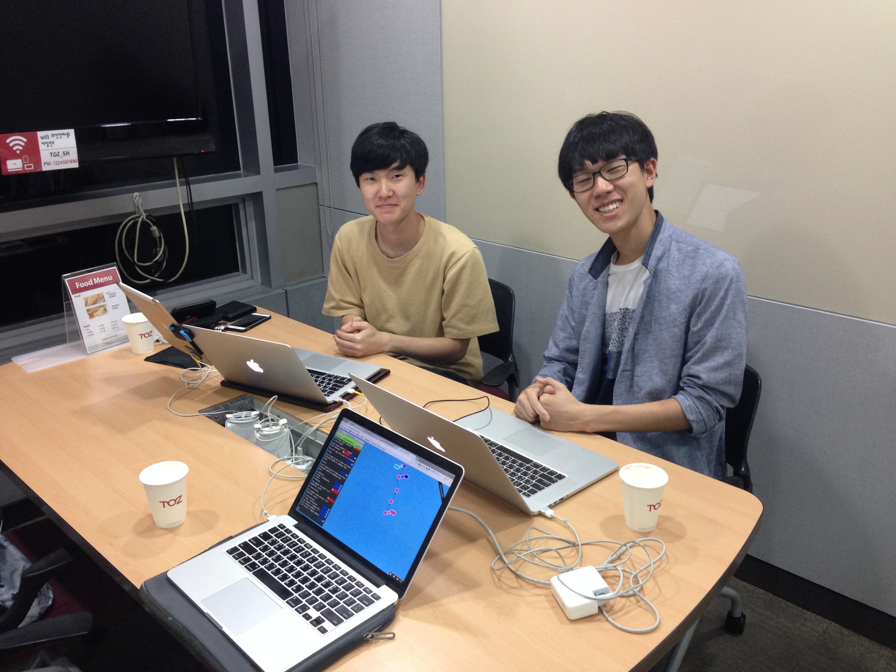
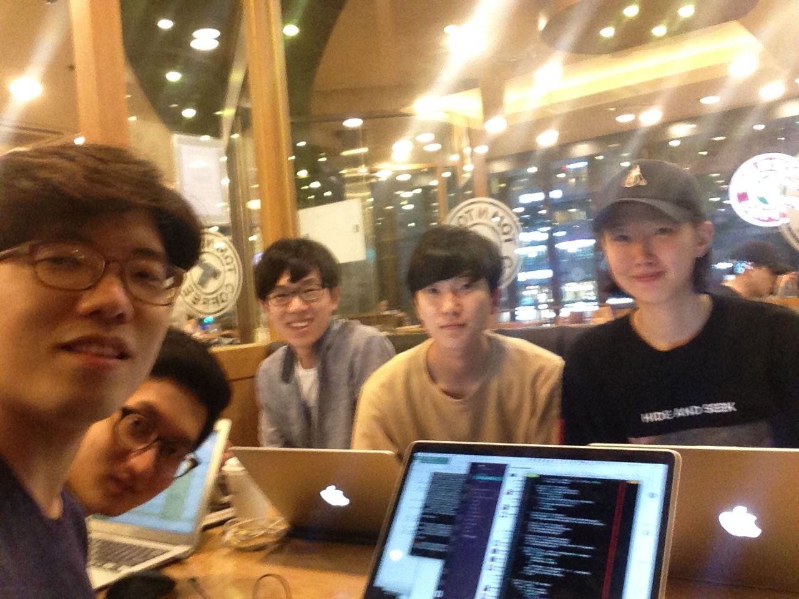

# 2016-09-24

팀 슬랙을 사용하기로 하였고 @closer27 님의 도움으로 생성하였습니다.
팀원 미팅과 함께 프로젝트 개요에 대한 이야기를 나누고
전원이 개발환경 구축을 마치고
할일을 정하고 다음과 같이 작업에 착수했습니다.

오늘은 개막식으로 인증을 대체합니다.

## 주제 선정

* @closer27: [#1](https://github.com/youknowone/Say/issues/1) 백엔드 NSSpeechSynthesizer 로 교체
* @sikeeo: [#2](https://github.com/youknowone/Say/issues/2) 비동기 재생
* @sikeeo & @Amanida: [#16](https://github.com/youknowone/Say/issues/16) iOS버전 개발
* @AWEEKJ: [#14](https://github.com/youknowone/Say/issues/14) 지정시간에 울리는 알람 기능 개발
* @kjy95: [#15](https://github.com/youknowone/Say/issues/15) URL을 넣으면 웹페이지 읽어주기
* @pmw9027: [#19](https://github.com/youknowone/Say/issues/19) 텍스트파일 불러오기 기능 개발
* @tobark: [#20](https://github.com/youknowone/Say/pull/20) 언어 선택 박스에 아무 문자나 입력할 수 있는 문제 수정
* @deffjoowon: [#8](https://github.com/youknowone/Say/issues/8) 다른 언어로 번역 후 읽어주는 기능을 추가
* @eeneguee [#22](https://github.com/youknowone/Say/issues/22) 선택한 텍스트가 있을 경우 선택한 텍스트만 재생

## 기타 활동

* @closer27: 많은 분들의 git/코드 이슈 해결을 도와주시고 있습니다.
* @tobark: [#10](https://github.com/youknowone/Say/issues/10) mp3로 다운받기를 추가하려 하였으나 시스템에서 지원이 되지 않는 것을 확인했습니다.

## 머지된 커밋
* @sikeeo: [#13](https://github.com/youknowone/Say/pull/13) Cocoapods 없는 환경에서 빌드할 수 있도록 프로젝트 설정 수정
* @tobark: [#20](https://github.com/youknowone/Say/pull/20) #20 완료
* @eeneguee: [#22](https://github.com/youknowone/Say/issues/22) 완료

# 2016-09-25

오늘은 오프라인 활동 없이 온라인으로만 활동하였습니다.

## 활동

* @pmw9027: [#21](https://github.com/youknowone/Say/pull/21) 에서 파일 불러오기 패치를 수정중이고 일시정지 및 다시 재생 기능 추가중
* @Amanida: [#23](https://github.com/youknowone/Say/pull/23) iOS 버전을 개발중입니다.
* @kjy95: [#25](https://github.com/youknowone/Say/pull/25) URL을 넣으면 내용을 읽어주는 기능을 개발중이고, 현재 제목을 읽어주는 단계까지 왔습니다.

#2016-09-26

오후 4시-오후11시까지 오프라인에서 작업을 하였습니다.

## 참가자
* @tobark
* @pmw9027
* @Amanida
* @AWEEKJ

## 활동
* @pmw9027: [#21](https://github.com/youknowone/Say/pull/21) 파일 불러오기 기능을 완성하고 연관된 UI 이슈도 수정하여 머지
* @Amanida: [#23](https://github.com/youknowone/Say/pull/23) [#39](https://github.com/youknowone/Say/pull/39) iOS 버전의 기본적인 기능을 구현하여 머지
* @AWEEKJ: [#37](https://github.com/youknowone/Say/pull/37) [#40](https://github.com/youknowone/Say/pull/40) 알람 기능과 연관된 UI 이슈를 구현 및 수정하여 머지
* @tobark: [#34](https://github.com/youknowone/Say/pull/34) 선택한 텍스트 재생 기능으로 인해 발생한 버그 수정 ([#22](https://github.com/youknowone/Say/pull/22))
* @closer27: [#36](https://github.com/youknowone/Say/pull/36) 말하기 백엔드를 명령줄 기반에서 NSSpeechSynthesizer로 완전히 교체

#2016-09-27

오후 4시-오후10시까지 오프라인에서 작업을 하였습니다

## 참가자
* @tobark
* @kjy95

## 활동
* @tobark: UI의 사소한 오류를 바로잡음
  * 창이 너무 작게 줄어들들지 않도 방지
  * 목소리 선택 콤보박스 동작 개선
* @kjy95: URL 읽어주기 기능 계속 진행
